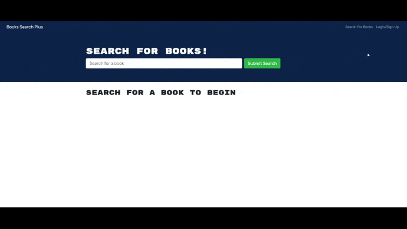

# Book Search Plus

[](https://opensource.org/licenses/MIT)
[](https://developer.mozilla.org/en-US/docs/Web/Progressive_web_apps)
[](https://webpack.js.org/)
[](https://reactjs.org/)
[](https://www.apollographql.com/)
[](https://www.apollographql.com/)
[](https://nodejs.org/en/docs/)
[](https://expressjs.com/)
[](https://www.mongodb.com/)
[](https://mongoosejs.com/)
[](https://www.javascript.com/)
[](https://developer.mozilla.org/en-US/docs/Glossary/HTML5)
[](https://developer.mozilla.org/en-US/docs/Web/CSS)
[](https://www.npmjs.com/package/jsonwebtoken)
[](https://getbootstrap.com/)

## Description

An application that allows the user to search for books and save the results to their profile. 

The app was built using the MERN stack with a React front end, MongoDB database, and Node.js/Express.js server and API.

## 📖Table of Contents
1. [Installation](#installation)
2. [Usage](#usage)
3. [Assets](#assets)
4. [Technologies](#technologies)
5. [License](#license)
6. [Contributing](#contributing)
7. [Tests](#tests)
8. [Questions](#questions)

## Installation
No installation is necessary to use the website.

If you wish to install the repository on your local machine, please follow the below steps:
1. To install this application clone it through GitHub using the following code in the terminal: 
    ``` 
    git clone https://github.com/TrushilBudhia/Book-Search-Plus.git
    ```
2. To add the dependencies to the application, navigate to the root directory for the application and run:
    ```js
    npm install
    ```
    
## Usage
An account can be creted with the signup button and once logged in, the user can search for books and save book results to their profile.

## Assets
Live demo of the application hosted on Heroku: [Book Search Plus](https://book-search-plus.herokuapp.com/)

The following images shows the functionality of the application: 




## Technologies
- [React](https://reactjs.org/)
- [Webpack](https://webpack.js.org/)
- [Apollo](https://www.apollographql.com/)
- [GraphQL](https://www.apollographql.com/)
- [Node.js](https://nodejs.org/en/docs/)
- [Express](https://expressjs.com/)
- [MongoDB](https://www.mongodb.com/)
- [Mongoose](https://mongoosejs.com/)
- [Nodemon](https://www.npmjs.com/package/nodemon)
- [Heroku](https://www.heroku.com/)
- JavaScript
- HTML5
- CSS3

## License
Copyright © 2021 [Trushil](https://github.com/TrushilBudhia)

This project is [MIT](./LICENSE) licensed

## Contributing
Contributions, issues and feature requests are welcome.

Feel free to check the [issues page](https://github.com/TrushilBudhia/Book-Search-Plus/issues) if you want to contribute.

## Tests
There are no tests currently for this application.

## Questions
For any questions, please contact the author:

- Github: [@Trushil](https://github.com/TrushilBudhia)
- Email: trushil.budhia@gmail.com


